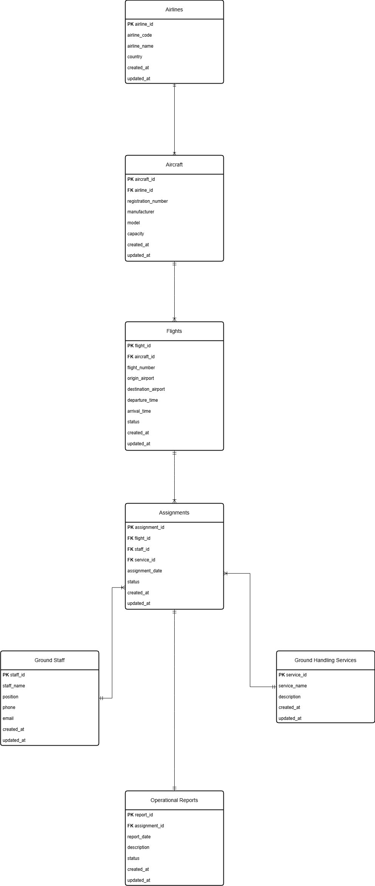

# Entity Relationship Diagram (ERD)

## Overview

This document presents the Entity Relationship Diagram (ERD) for the AeroOps Ground Handling Management System.

The ERD illustrates the relationships between entities used in the database design and serves as the primary reference during database implementation.

---

## Entity Relationships

| Parent Entity | Relationship | Child Entity |
|--------------|:------------:|--------------|
| Airlines | 1 : N | Aircraft |
| Aircraft | 1 : N | Flights |
| Flights | 1 : N | Assignments |
| Ground Staff | 1 : N | Assignments |
| Ground Handling Services | 1 : N | Assignments |
| Assignments | 1 : 1 | Operational Reports |

---

## ERD Diagram

---

## Notes

The database design follows normalization principles to reduce redundancy and maintain data integrity.

Primary keys (PK) uniquely identify each record, while foreign keys (FK) define relationships between tables.

The ERD shown above represents the current Minimum Viable Product (MVP) version of AeroOps.

---

## Future Improvements

Future versions of AeroOps may include additional entities such as:

- Airports
- Users
- Roles & Permissions
- Flight Crews
- Maintenance Records
- Flight Logs