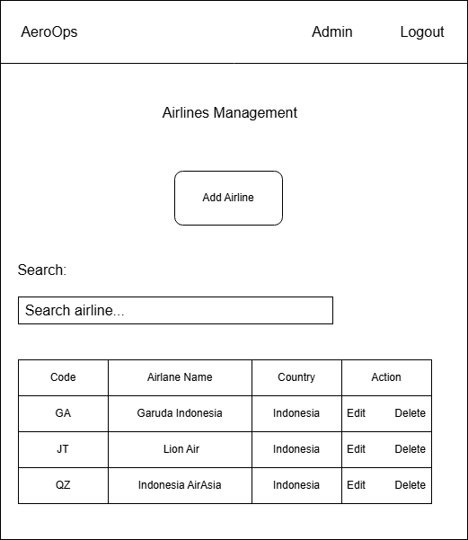
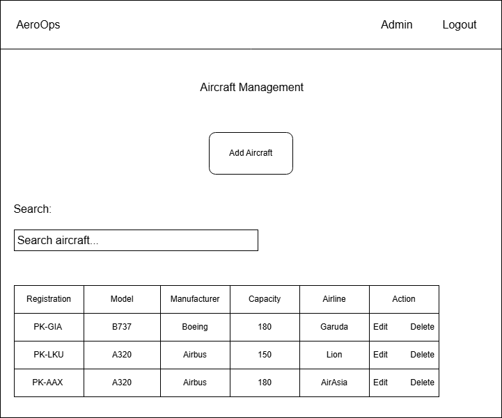
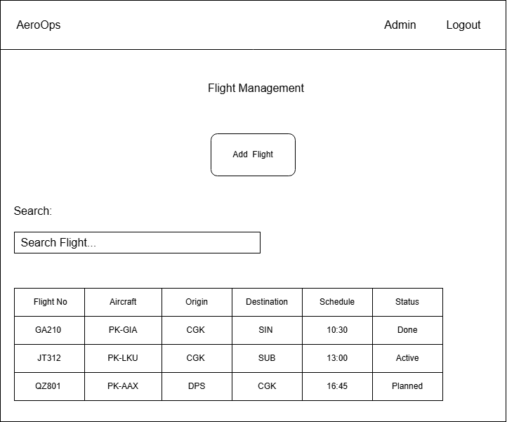

# User Interface Design

## Overview

The AeroOps user interface is designed to be simple, responsive, and easy to navigate.

---

## Planned Pages

### Authentication

- Login
- User Profile

---

### Dashboard

- Dashboard Overview
- Flight Statistics
- Staff Statistics
- Assignment Summary

---

### Master Data

- Airlines
- Aircraft
- Ground Staff
- Ground Handling Services

---

### Operations

- Flight Management
- Assignment Management
- Operational Reports

---

## Future Improvements

- Dark Mode
- Search & Filter
- Export PDF
- Responsive Mobile Layout

# User Interface Design

## Login Wireframe

The initial login page wireframe for AeroOps.

## Dashboard Wireframe

The dashboard provides an overview of airport ground handling operations.

## Airlines Management Wireframe

The airline management page allows administrators to manage airline master data including adding, searching, updating, and deleting airline information.

## Aircraft Management Wireframe

The aircraft management page allows administrators to manage aircraft information related to airline ownership.

## Flight Management Wireframe

The flight management page allows administrators to manage flight schedules, aircraft assignment, routes, and operational status.

