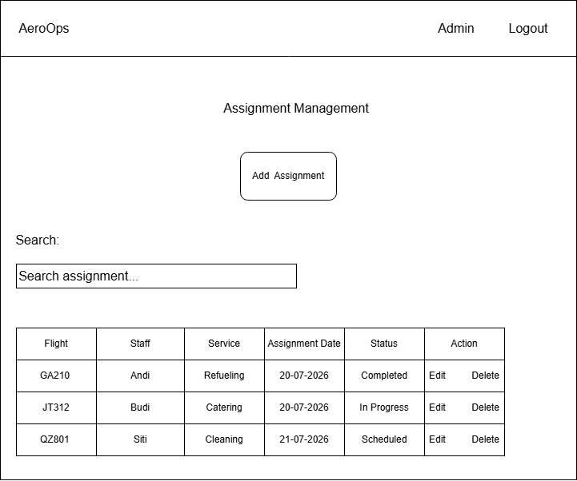
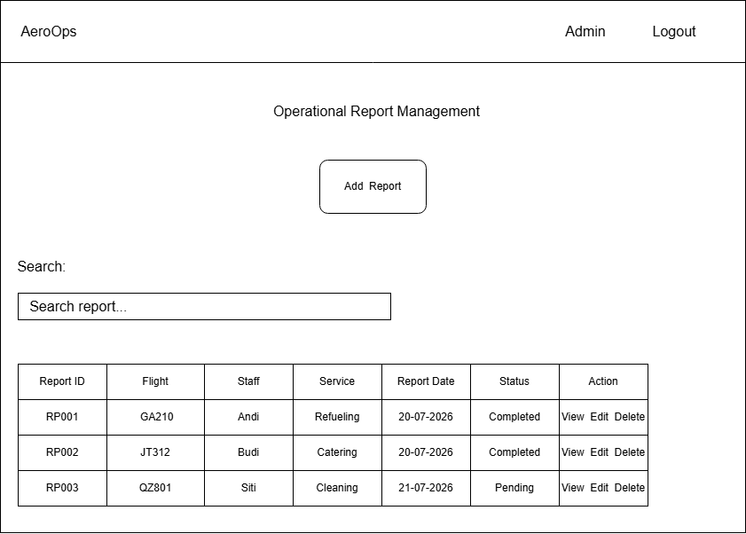

# User Interface Design

## Overview

The AeroOps user interface is designed to be simple, responsive, and easy to navigate. This document provides an overview of the planned pages, wireframes, and future interface improvements for the AeroOps Ground Handling Management System.

---

## Table of Contents

- Overview
- Planned Pages
- Future Improvements
- Login Wireframe
- Dashboard Wireframe
- Airlines Management Wireframe
- Aircraft Management Wireframe
- Flight Management Wireframe
- Assignment Management Wireframe
- Operational Report Management Wireframe

---

## Planned Pages

### Authentication

- Login
- User Profile

### Dashboard

- Dashboard Overview
- Flight Statistics
- Staff Statistics
- Assignment Summary

### Master Data

- Airlines
- Aircraft
- Ground Staff
- Ground Handling Services

### Operations

- Flight Management
- Assignment Management
- Operational Reports

---

## Future Improvements

The following features are planned for future versions of AeroOps.

- Dark Mode
- Search & Filter
- Export PDF
- Responsive Mobile Layout
- Role-Based Access Control (RBAC)
- Dashboard Analytics
- REST API Integration
- React Frontend

---

# Wireframes

## Login Wireframe

The login page is the entry point for authorized users to access the AeroOps system.

### Features

- Email input
- Password input
- Login button

---

## Dashboard Wireframe

The dashboard provides a summary of airport ground handling operations and key statistics.

### Features

- Flight Statistics
- Aircraft Statistics
- Staff Statistics
- Assignment Summary
- Recent Flight Schedule

---

## Airlines Management Wireframe

This page allows administrators to manage airline master data.

### Features

- Add Airline
- Search Airline
- Update Airline
- Delete Airline
- Airline List

---

## Aircraft Management Wireframe

This page is used to manage aircraft information associated with airlines.

### Features

- Add Aircraft
- Search Aircraft
- Update Aircraft
- Delete Aircraft
- Aircraft List

---

## Flight Management Wireframe

This page manages flight schedules, aircraft assignments, routes, and flight status.

### Features

- Add Flight
- Search Flight
- Update Flight
- Delete Flight
- Flight Schedule

---

## Assignment Management Wireframe

This page manages ground staff assignments for each flight and service.

### Features

- Assign Staff
- Search Assignment
- Update Assignment
- Delete Assignment
- Assignment Status

---

## Operational Report Management Wireframe

This page displays reports generated after ground handling activities have been completed.

### Features

- View Reports
- Search Reports
- Update Report Status
- Report History

---

## Notes

This document contains low-fidelity wireframes intended to illustrate the overall user interface layout and navigation flow. Visual design elements such as colors, typography, icons, and branding will be implemented during the frontend development phase.

---

## Future Development

The current wireframes represent **Version 1 (MVP)** of AeroOps.

Future versions may include:

- Mobile-friendly interface
- Interactive dashboard charts
- Notification system
- Flight delay monitoring
- Real-time assignment updates
- Multi-role dashboard
- REST API integration
- React frontend implementation